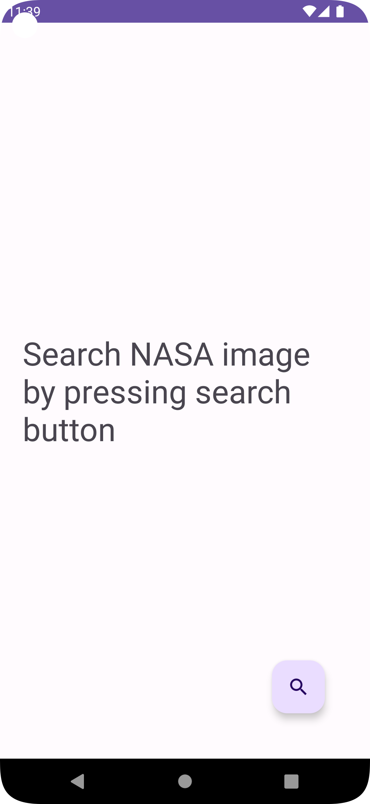

# Ankitigiri Gusai Workday Mobile Engineer Take Home Test

## Libraries used

### Third-party Libraries used

1. **Retrofit** with __converter-gson__ and __logging-interceptor__
2. **Glide**

### Architecture Components used

1. **Coroutine with Flow**
2. **ViewModel**
3. **Navigation Component**
4. **Paging Library**

## Overview of the app architecture

I have tried to follow single Activity MVVM pattern with clear saperation between ViewModel, Views and Data source.  Activity ViewModel is shared between listing and detail fragment as it made sense in these case. ~~DataBinding~~ ViewBinding is used to bind model to View (Althogh I prefer DataBinding in more complex projects)

## how to build / run the app

Open the Project in Android Studio, click **Build** from menu options and select **Rebuild Project** and then press Run 'app'.

## App Screenshots

## Additional Detail
I have not been able to put much efforts into the testing part of the requirements but rest of the app I have tried to optimize best to my knowledge :). 
